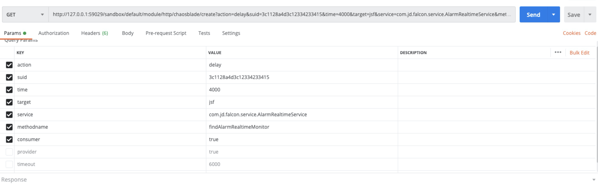
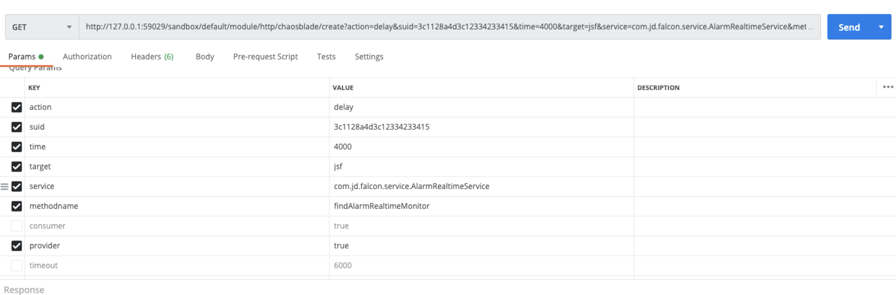
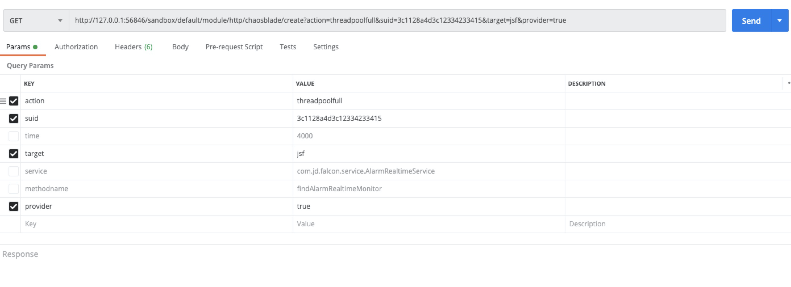
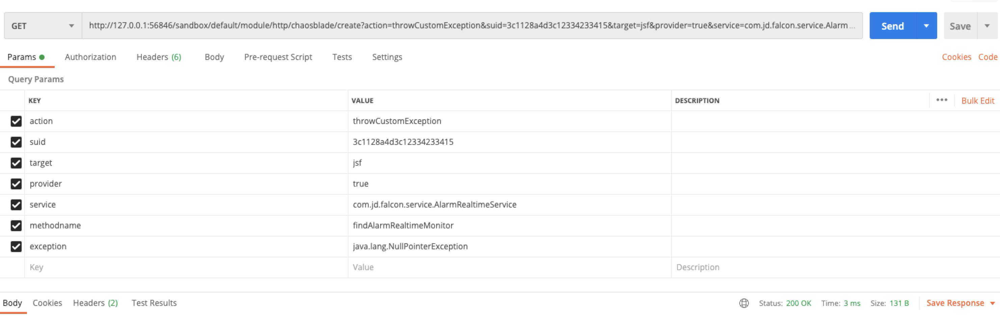

# 1.延迟场景
## consumer延迟
```
GET http://127.0.0.1:59029/sandbox/default/module/http/chaosblade/create?
action=delay&
suid=3c1128a4d3c12334233415&
time=4000&
target=jsf&
service=com.jd.falcon.service.AlarmRealtimeService&
methodname=findAlarmRealtimeMonitor&
consumer=true
```

## provider延迟
```
http://127.0.0.1:59029/sandbox/default/module/http/chaosblade/create?
action=delay&
suid=3c1128a4d3c12334233415&
time=4000&
target=jsf&
service=com.jd.falcon.service.AlarmRealtimeService&
methodname=findAlarmRealtimeMonitor&
provider=true
```

# 2.线程池打满场景
```
http://127.0.0.1:56846/sandbox/default/module/http/chaosblade/create?
action=threadpoolfull&
suid=3c1128a4d3c12334233415&
target=jsf&provider=true
```


# 3.异常场景
```
http://127.0.0.1:56846/sandbox/default/module/http/chaosblade/create?
action=throwCustomException&
suid=3c1128a4d3c12334233415&
target=jsf&
provider=true&
service=com.jd.falcon.service.AlarmRealtimeService&
methodname=findAlarmRealtimeMonitor&
exception=java.lang.NullPointerException
```

